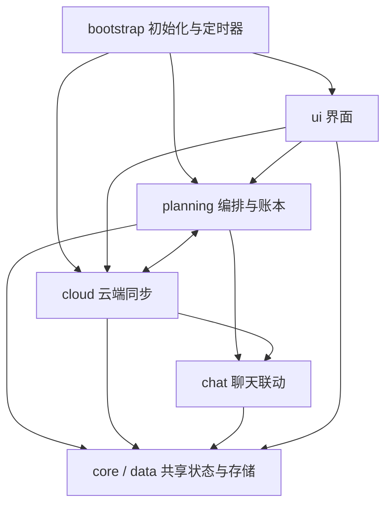

# 挂念源码结构

维护 `src/`，构建得到 `index.html`，安装包仍用单 HTML 入口。根目录的 `index.html` 是提交到仓库的生成产物，不直接编辑。

当前结构包括 25 个 JS 片段（23 个原有片段及回执查询、同步状态展示两个新增片段）与 2 个独立 ES modules。片段仍共享原来的 IIFE 闭包，`S` 是应用状态，各角色的 `cx` 保存当天计划、账本和运行状态；时间计算与规则评分已抽到 `src/domain/`，有独立作用域和明确导出，不读取 `S`、宿主 SDK、存储或系统当前时间。其他片段之间仍有双向调用。

## 独立模块接口

| 模块 | 导出 | 输入约定 |
| --- | --- | --- |
| `domain/time.mjs` | `localDateKey`、`formatLocalTime`、`parseLocalDate`、`normalizeTime`、`timeOnLocalDay`、`addMinutes`、`isInTimeWindow`、`getSleepWindow`、`isAsleep` | 日期、时间戳、时间字符串、作息设置由调用方传入；按运行环境本地时区计算 |
| `domain/scoring.mjs` | `fitScore`、`calculateScore`、`countUnansweredRounds` | 明确传入当地小时数、预约时间、已预约数量、未回应轮数、额度、间隔；统计轮数时传入 `nowMs` |

模块可由 Node 直接 `import`，不需要模拟 `AiPhone` 或加载 APP。它们不修改参数；时钟留在旧调用位置的薄封装中，设置按每次调用时的当前值传入，避免缓存旧设置。

时间模块保留旧版边界：时间窗左闭右开，跨零点有效，起止相同视为关闭；分钟累加最晚停在 23:59；本地日期使用 Date 的夏令时规则。`getSleepWindow().overnight` 的历史含义为 `bed < wake`，名称虽然容易误解，本次保留以兼容现有调用方。`timeOnLocalDay` 需要明确日期锚点，旧 `timeToMs` 封装负责提供“今天”。

评分模块保留原公式、取整、上限和权重；连续 3 分钟内的气泡归一轮，满 30 分钟才算未回应。本次没有修改云端规则或设备锁。

## 文件导航

| 文件或目录 | 负责什么 | 常见改动入口 |
| --- | --- | --- |
| `src/page.html` | HTML 骨架、原来的 IIFE 外壳；两个占位符由构建替换 | 页面容器、顶部和弹层骨架 |
| `src/styles.css` | 所有界面样式 | 颜色、布局、字体 |
| `src/domain/time.mjs` | 独立的日期、时间窗和作息计算 | 时间边界 |
| `src/domain/scoring.mjs` | 独立的评分与未回应轮次计算 | 评分公式 |
| `src/core/runtime.js` | `S`、角色上下文、日期和 DOM 工具、toast、日志 | 共享状态和日志 |
| `src/core/model.js` | JSON 解析、模型调用、用量汇总和日期解析 | 生成调用与用量限制 |
| `src/core/character-state.js` | 作息、精力、情绪、情况衰减、读取聊天 | TA 此刻的生活状态 |
| `src/data/defaults.js` | `upsert` 与设置默认值 | 新设置和默认值 |
| `src/data/storage.js` | 设置加载/迁移、串行保存、当天数据加载 | 持久化与旧版兼容 |
| `src/cloud/connection.js` | 云连接、请求、设备锁与接管 | 云端请求和设备身份 |
| `src/cloud/plans.js` | 裁决上下文、串行计划上传、同步状态持久化和重试 | 本地计划寄存云端 |
| `src/cloud/receipts.js` | 按预约键精确读取回执、60 秒会话缓存 | 发送状态证据 |
| `src/cloud/day.js` | 模板冻结、明日生成原料、接管云端生成结果 | 关闭浏览器后的生成 |
| `src/cloud/decisions.js` | 合并云端裁决、回执、同步账本 | 云端与本地计划对齐 |
| `src/planning/calendar.js` | 系统日历读写、自动生成入口、节假日信息 | 日历同步 |
| `src/planning/threads.js` | 惦记存活、日期、发送结算、撤预约、存账本 | 惦记与发送结果 |
| `src/planning/moments.js` | 朋友圈配额、发帖、消费云端 outbox | 主动朋友圈 |
| `src/planning/generation.js` | 应用模型给出的惦记变更、生成一天、提示词与结果解析 | 生活面生成 |
| `src/planning/wakes.js` | 规则评分、预约、取消、哨兵、编排 | 主动消息计划 |
| `src/planning/recheck.js` | 打开/定时动态复核、临时起念 | 调整当天计划 |
| `src/chat/context.js` | 预览、提示词注入、回复门、好感和在线状态 | 与宿主聊天的联动 |
| `src/ui/sync-status.js` | 跨页签显示计划同步结果、绑定重试入口 | 本地保存与云端同步反馈 |
| `src/ui/main.js` | 主渲染、页签、总览卡片与事件 | 首页和心动页 |
| `src/ui/details.js` | 记录加载、时刻详情弹层 | 时刻详情 |
| `src/ui/calendar.js` | 日程详情、细化与编辑 | 修改日程 |
| `src/ui/history.js` | 裁决记录、历史页面、预览区 | 历史回看 |
| `src/ui/diagnostics.js` | 用量、诊断卡与事件 | 排障和用量界面 |
| `src/ui/settings.js` | 设置 schema、表单、保存动作 | 设置面板 |
| `src/bootstrap.js` | 初始化、宿主事件与定时循环 | 启动流程 |
| `src/bundle.json` | 显式拼接顺序 | 新增文件时在这里登记 |

`core/model.js` 和 `planning/generation.js` 里仍保留部分原来相邻的工具函数，目的是保持初始化顺序不变；此阶段不把目录名当作强制的依赖边界。

## 依赖关系



图表示主要调用方向，不是无环模块图。例如云端接管完成会刷新界面，模型用量统计会调用云端，`planning/generation.js` 的模型结果会更新 `planning/threads.js` 的账本。`AiPhone`、`window`、`document` 由宿主/浏览器提供。

构建脚本先使用项目已有的 TypeScript 编译器，将两个无运行时依赖的 `.mjs` 模块编译到各自独立的作用域，通过冻结的 `GuaNianTime` 和 `GuaNianScoring` 导出对象连接旧代码；然后按 `bundle.json` 顺序拼接原有 `.js` 片段，最后执行 `bootstrap.js` 中的 `init()`。发布产物仍是经典内联脚本，没有浏览器相对 import 或额外模块加载器。

不要把片段单独作为 `<script src>` 加载，也不要在原有 `.js` 片段里增加 `import`、`export` 或自己的外层 IIFE。`domain/*.mjs` 使用真正的 ESM 导出，当前两个模块各自自足；若将来要增加模块间 import，需要同步扩展构建的依赖处理。

## 修改与验证

在仓库根目录运行：

```bash
npm run gua-nian:build
npm run gua-nian:check
npm run gua-nian:test
node scripts/check-fork-regressions.mjs
```

`build` 合成页面并检查完整脚本语法；`check` 只校验源码和产物是否一致。宿主 `npm run build` 已加入合成步骤，fork 回归脚本也会先检查产物是否过期。提交时带上修改的源码和重新生成的 `index.html`。

JS 片段共用顶层声明，ESLint 按脚本处理，并仅对这些片段关闭逐文件的“未使用变量”检查。独立 `.mjs` 模块保留正常检查，并禁止访问应用状态、浏览器宿主、网络、定时器及隐式当前时间。`gua-nian:test` 在 UTC、上海、纽约三个时区验证纯模块边界、独立导入和打包后的接线；完整 APP 的其他回归由 fork 检查覆盖。

## 安装包

```bash
npm run gua-nian:package
```

该命令先构建，再把 `manifest.json`、`index.html`、`icon.png`、`presets.json`、`README.md` 放进 `out/custom-apps/gua-nian-<版本>.zip`。`out/` 已由 Git 忽略；源码不装进手机沙盒，安装方式与此前相同。

首次分文件整理时 HTML 逐字节一致，基线 SHA-256 为 `7758c59925539da52027b3f3f9d34728f66e29dae8f5e70931a24b995cf42de8`。此次独立模块重构改变了代码组织，不能再声称 HTML 字节相同；已在三个时区分别与旧实现对照 14,721 组输入，结果一致，并通过 23 项 fork 回归。该阶段沿用 0.9.12。后续发送状态和同步反馈改动已升级为 0.9.13，详见 README。

设备锁的并发覆盖问题按此前约定暂缓，分文件只是保留现有实现。云端 `supabase/functions/push-recheck/index.ts` 仍独立维护；修改双方共有规则时需同时核对云端逻辑。


## 发送状态与计划同步（0.9.13）

`cloud/receipts.js` 按 `timedwake:<wakeId>` 每批最多 20 条查询，检查网关回显的查询键，并逐条匹配结果。缓存按角色、云地址与预约键隔离；查询失败保留上次回执并标注刷新失败，进行中旧状态退回待确认。详情与记录页不再读取聊天来推测发送成功或回复率。缓存不是持久发送日志，服务器清理了旧任务后只能显示待确认。

`cloud/plans.js` 对每个角色串行上传，返回明确结果；运行时状态在 `cx._planSync`，持久状态在 `settings.planSync[characterId]`，以日期和云地址限定有效范围。失败保留需要重置裁决的标记，成功后清除；部分字段被网关丢弃时显示部分同步，不误报完整成功。`ui/sync-status.js` 渲染模板中独立的 `#cloud-sync` 容器，不依赖当前页签。

普通保存和手动重试使用原有计划锁，成功读取并合并云端裁决后才上传当前计划；不改设备接管协议。网络失败不吞掉成成功结果，回执查询、计划 POST 和重试前 GET 均有 15 秒超时。保存设置的提示只确认现有计划同步，不扩展为整条离线发送链路的健康结论。

`scripts/check-gua-nian-delivery.mjs` 运行真实打包脚本，模拟宿主数据、网络和最小 DOM，验证预约关联、状态分类、详情刷新、失败持久化、严格读取后重试、请求超时、串行上传与保存提示。已接入 `npm run gua-nian:test`；这不是手机端完整操作验证。


## 设置生效与中性回音

`settingsSaveEffects(before, after)` 对本次保存的改动生成说明，显示在独立的 `#settings-effects` 容器；仅当前页面会话保留，下次保存替换。说明区分未来判断使用的规则、不会自动重建的已有预约，以及尚需下一次打开或编排来刷新的明日生成原料，不把计划上传成功等同于所有设置追溯生效。

`push-recheck` 的 `fbMod` 只按累计接话次数给有限正反馈，少于 3 次为 1，之后每次增加 0.04，最多 1.20。旧 `[发送数, 接话数]` 格式保留，增加未接话次数不会降低权重。`fbLine` 不再向模型提供负面喜好结论；角色作息并不代表用户作息。诊断页使用同一公式，回归测试对照本地与云端结果；当前 3 小时统计窗口和防打扰降速机制保持独立。改变云端行为需要更新 push-recheck。


## 用户可选睡眠窗

默认设置 `userSleepOn: false`，独立的 `userSleepStart` / `userSleepEnd` 只服务回音统计，不复用角色作息或 `quietStart/quietEnd`。保存时校验有效 HH:mm 和起止不同；关闭时禁用时间输入，但保留已填写时段。`userSleepContext()` 把开关、时段、设备 IANA 时区及当前 UTC 偏移加入今天的计划和明日原料，网关显式保留这些字段。

云端 `feedbackWindowEnd` 按实际成功时间累计 3 小时非睡眠时间，分钟边界使用绝对时间，保留发送时间的秒/毫秒；IANA 时区处理夏令时，缺失或不支持时使用上传的固定偏移。未满窗口不记 `fbSeen`，完成后查询发送至延长截止时间之间的接话；即使设定的睡眠时段内实际有回复，也接受为正反馈。睡眠设置变更只影响尚未结算的记录，不重算历史。

`feedbackWithPreviousDay` 在今天的统计中读取昨天的计划，合并累计回音基线和已结算键，再处理昨晚未完成的窗口；昨天的起念仍保持停用。前一天基线读取失败时下轮重试，避免错算。与原链路一样，统计依赖云端存在近期计划及预约回执，不是独立常驻的睡眠监测服务。

验证涵盖默认关闭、开关往返、非法时间、网关字段保留、跨夜及睡眠内发送、夏令时切换、毫秒边界、次晨接话、跨日续算和失败重试。新增字段需要更新网关与 push-recheck，无 schema 迁移。


## 云端联通修复与 schema 8

`syncSavedPlan` 统一设置保存的严格读取与合并；读取失败禁止上传旧计划。`recheck-control` 经实际 worker 能力探测后调用 `push_recheck_set_enabled`，数据库锁定同角色从指定日期起的现存计划，校验 owner，再用 `jsonb_set` 仅修改 `context.recheckEnabled`，保留 items、decisions、genKit 和回音。失败返回可重试状态，重新开启失败也保留控制操作；关闭状态下仍显示失败卡片，无本地计划也可关闭云端已有计划。需要执行 schema 8 并更新两个云函数。

worker 的 `capabilities` 请求仍校验 cron token，只返回能力，不生成或复核。停用检查在独立的 genKit 分支之后、生活和回音计算之前；上下文 PATCH 带启用条件，模型返回后再次确认启用状态。关闭不是取消已有预约，已经进入执行阶段的请求仍可能完成。设备接管并发协议继续保持原约定，不在本次修复范围。

开启用户睡眠后，今天计划和未来生成原料都核对实际 worker 的 `user-sleep-feedback-v1` 能力与网关 `acceptedUserSleep` 回显。能力缺失、读取失败或保存值不一致均不显示成功。应用拉取及网关上传都按内容合并 `fbSeen`，去重后保留最后 60 条，修复等长记录漏合并。


## 发圈回执与记录

`planning/moments.js` 在 `settings.momentHistory[characterId]` 持久保存最近 60 个起意结果，`ui/history.js` 在记录页展示；独立于当天计划和 120 条滚动运行日志。发布成功必须收到宿主 postId，成功记录和本地周计数同一次 patchSettings 保存；失败、未创建及待配额不记为已发布。云端预留的 momentsLast/momentsWeekN 不当作已发布回执合入本地。

云端待发列表按起意时间选最新一条，较早项明确记录合并未发布，入口重新检查最小间隔与周额度，并用实际时间发帖。运行时 outbox/发帖锁防止同页并发；稳定 requestId 由宿主按 APP 和角色隔离，MomentPost 保存该编号，重试返回已有帖子编号。历史记录用于跨日去重，不再只依赖 plan.postedIds。

宿主 moments-engine 保留本轮的一个完整朋友圈动作自行入库，只把其他类型动作交给通用分发器。去掉思考标签区后解析完整朋友圈块，未标记草稿或未闭合正文不发布。变化需同时更新宿主与 APP，不涉及云函数和 schema。
