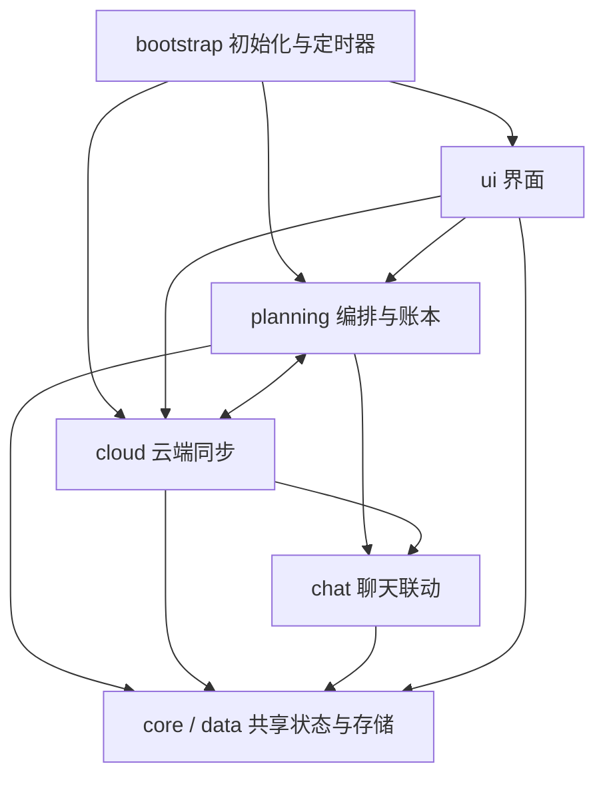

# 挂念源码结构

维护 `src/`，构建得到 `index.html`，安装包仍用单 HTML 入口。根目录的 `index.html` 是提交到仓库的生成产物，不直接编辑。

当前结构包括 25 个 JS 片段（23 个原有片段及回执查询、同步状态展示两个新增片段）与 4 个独立模块（含共享的历史窗口 TypeScript 模块）。片段仍共享原来的 IIFE 闭包，`S` 是应用状态，各角色的 `cx` 保存当天计划、账本和运行状态；时间计算与规则评分已抽到 `src/domain/`，有独立作用域和明确导出，不读取 `S`、宿主 SDK、存储或系统当前时间。其他片段之间仍有双向调用。

## 独立模块接口

| 模块 | 导出 | 输入约定 |
| --- | --- | --- |
| `domain/time.mjs` | `localDateKey`、`formatLocalTime`、`parseLocalDate`、`normalizeTime`、`timeOnLocalDay`、`addMinutes`、`isInTimeWindow`、`getSleepWindow`、`isAsleep` | 日期、时间戳、时间字符串、作息设置由调用方传入；按运行环境本地时区计算 |
| `domain/scoring.mjs` | `fitScore`、`calculateScore`、`countUnansweredRounds` | 明确传入当地小时数、预约时间、已预约数量、未回应轮数、额度、间隔；统计轮数时传入 `nowMs` |

模块可由 Node 直接 `import`，不需要模拟 `AiPhone` 或加载 APP。它们不修改参数；时钟留在旧调用位置的薄封装中，设置按每次调用时的当前值传入，避免缓存旧设置。

时间模块保留旧版边界：时间窗左闭右开，跨零点有效，起止相同视为关闭；分钟累加最晚停在 23:59；本地日期使用 Date 的夏令时规则。`getSleepWindow().overnight` 的历史含义为 `bed < wake`，名称虽然容易误解，本次保留以兼容现有调用方。`timeOnLocalDay` 需要明确日期锚点，旧 `timeToMs` 封装负责提供“今天”。

评分模块保留原公式、取整、上限和权重；连续 3 分钟内的气泡归一轮，满 30 分钟才算未回应。本次没有修改云端规则或设备锁。

## 文件导航

| 文件或目录 | 负责什么 | 常见改动入口 |
| --- | --- | --- |
| `src/page.html` | HTML 骨架、原来的 IIFE 外壳；两个占位符由构建替换 | 页面容器、顶部和弹层骨架 |
| `src/styles.css` | 所有界面样式 | 颜色、布局、字体 |
| `src/domain/time.mjs` | 独立的日期、时间窗和作息计算 | 时间边界 |
| `src/domain/scoring.mjs` | 独立的评分与未回应轮次计算 | 评分公式 |
| `src/core/runtime.js` | `S`、角色上下文、日期和 DOM 工具、toast、日志 | 共享状态和日志 |
| `src/core/model.js` | JSON 解析、模型调用、用量汇总和日期解析 | 生成调用与用量限制 |
| `src/core/character-state.js` | 作息、精力、情绪、情况衰减、读取聊天 | TA 此刻的生活状态 |
| `src/data/defaults.js` | `upsert` 与设置默认值 | 新设置和默认值 |
| `src/data/storage.js` | 设置加载/迁移、串行保存、当天数据加载 | 持久化与旧版兼容 |
| `src/cloud/connection.js` | 云连接、请求、设备锁与接管 | 云端请求和设备身份 |
| `src/cloud/plans.js` | 裁决上下文、串行计划上传、同步状态持久化和重试 | 本地计划寄存云端 |
| `src/cloud/receipts.js` | 按预约键精确读取回执、60 秒会话缓存 | 发送状态证据 |
| `src/cloud/day.js` | 模板冻结、明日生成原料、接管云端生成结果 | 关闭浏览器后的生成 |
| `src/cloud/decisions.js` | 合并云端裁决、回执、同步账本 | 云端与本地计划对齐 |
| `src/planning/calendar.js` | 系统日历读写、自动生成入口、节假日信息 | 日历同步 |
| `src/planning/threads.js` | 惦记存活、日期、发送结算、撤预约、存账本 | 惦记与发送结果 |
| `src/planning/moments.js` | 朋友圈配额、发帖、消费云端 outbox | 主动朋友圈 |
| `src/planning/generation.js` | 应用模型给出的惦记变更、生成一天、提示词与结果解析 | 生活面生成 |
| `src/planning/wakes.js` | 规则评分、预约、取消、哨兵、编排 | 主动消息计划 |
| `src/planning/recheck.js` | 打开/定时动态复核、临时起念 | 调整当天计划 |
| `src/chat/context.js` | 预览、提示词注入、回复门、好感和在线状态 | 与宿主聊天的联动 |
| `src/ui/sync-status.js` | 跨页签显示计划同步结果、绑定重试入口 | 本地保存与云端同步反馈 |
| `src/ui/main.js` | 主渲染、页签、总览卡片与事件 | 首页和心动页 |
| `src/ui/details.js` | 记录加载、时刻详情弹层 | 时刻详情 |
| `src/ui/calendar.js` | 日程详情、细化与编辑 | 修改日程 |
| `src/ui/history.js` | 裁决记录、历史页面、预览区 | 历史回看 |
| `src/ui/diagnostics.js` | 用量、诊断卡与事件 | 排障和用量界面 |
| `src/ui/settings.js` | 设置 schema、表单、保存动作 | 设置面板 |
| `src/bootstrap.js` | 初始化、宿主事件与定时循环 | 启动流程 |
| `src/bundle.json` | 显式拼接顺序 | 新增文件时在这里登记 |

`core/model.js` 和 `planning/generation.js` 里仍保留部分原来相邻的工具函数，目的是保持初始化顺序不变；此阶段不把目录名当作强制的依赖边界。

## 依赖关系



图表示主要调用方向，不是无环模块图。例如云端接管完成会刷新界面，模型用量统计会调用云端，`planning/generation.js` 的模型结果会更新 `planning/threads.js` 的账本。`AiPhone`、`window`、`document` 由宿主/浏览器提供。

构建脚本先使用项目已有的 TypeScript 编译器，将三个无运行时依赖的 `.mjs` 模块编译到各自独立的作用域，通过冻结的 `GuaNianTime` 和 `GuaNianScoring` 导出对象连接旧代码；然后按 `bundle.json` 顺序拼接原有 `.js` 片段，最后执行 `bootstrap.js` 中的 `init()`。发布产物仍是经典内联脚本，没有浏览器相对 import 或额外模块加载器。

不要把片段单独作为 `<script src>` 加载，也不要在原有 `.js` 片段里增加 `import`、`export` 或自己的外层 IIFE。`domain/*.mjs` 使用真正的 ESM 导出，当前两个模块各自自足；若将来要增加模块间 import，需要同步扩展构建的依赖处理。

## 修改与验证

在仓库根目录运行：

```bash
npm run gua-nian:build
npm run gua-nian:check
npm run gua-nian:test
node scripts/check-fork-regressions.mjs
```

`build` 合成页面并检查完整脚本语法；`check` 只校验源码和产物是否一致。宿主 `npm run build` 已加入合成步骤，fork 回归脚本也会先检查产物是否过期。提交时带上修改的源码和重新生成的 `index.html`。

JS 片段共用顶层声明，ESLint 按脚本处理，并仅对这些片段关闭逐文件的“未使用变量”检查。独立 `.mjs` 模块保留正常检查，并禁止访问应用状态、浏览器宿主、网络、定时器及隐式当前时间。`gua-nian:test` 在 UTC、上海、纽约三个时区验证纯模块边界、独立导入和打包后的接线；完整 APP 的其他回归由 fork 检查覆盖。

## 安装包

```bash
npm run gua-nian:package
```

该命令先构建，再把 `manifest.json`、`index.html`、`icon.png`、`presets.json`、`README.md` 放进 `out/custom-apps/gua-nian-<版本>.zip`。`out/` 已由 Git 忽略；源码不装进手机沙盒，安装方式与此前相同。

首次分文件整理时 HTML 逐字节一致，基线 SHA-256 为 `7758c59925539da52027b3f3f9d34728f66e29dae8f5e70931a24b995cf42de8`。此次独立模块重构改变了代码组织，不能再声称 HTML 字节相同；已在三个时区分别与旧实现对照 14,721 组输入，结果一致，并通过 23 项 fork 回归。该阶段沿用 0.9.12。后续发送状态和同步反馈改动已升级为 0.9.13，详见 README。

设备锁的并发覆盖问题按此前约定暂缓，分文件只是保留现有实现。云端 `supabase/functions/push-recheck/index.ts` 仍独立维护；修改双方共有规则时需同时核对云端逻辑。


## 发送状态与计划同步（0.9.13）

`cloud/receipts.js` 按 `timedwake:<wakeId>` 每批最多 20 条查询，检查网关回显的查询键，并逐条匹配结果。缓存按角色、云地址与预约键隔离；查询失败保留上次回执并标注刷新失败，进行中旧状态退回待确认。详情与记录页不再读取聊天来推测发送成功或回复率。缓存不是持久发送日志，服务器清理了旧任务后只能显示待确认。

`cloud/plans.js` 对每个角色串行上传，返回明确结果；运行时状态在 `cx._planSync`，持久状态在 `settings.planSync[characterId]`，以日期和云地址限定有效范围。失败保留需要重置裁决的标记，成功后清除；部分字段被网关丢弃时显示部分同步，不误报完整成功。`ui/sync-status.js` 渲染模板中独立的 `#cloud-sync` 容器，不依赖当前页签。

普通保存和手动重试使用原有计划锁，成功读取并合并云端裁决后才上传当前计划；不改设备接管协议。网络失败不吞掉成成功结果，回执查询、计划 POST 和重试前 GET 均有 15 秒超时。保存设置的提示只确认现有计划同步，不扩展为整条离线发送链路的健康结论。

`scripts/check-gua-nian-delivery.mjs` 运行真实打包脚本，模拟宿主数据、网络和最小 DOM，验证预约关联、状态分类、详情刷新、失败持久化、严格读取后重试、请求超时、串行上传与保存提示。已接入 `npm run gua-nian:test`；这不是手机端完整操作验证。


## 设置生效与中性回音

`settingsSaveEffects(before, after)` 对本次保存的改动生成说明，显示在独立的 `#settings-effects` 容器；仅当前页面会话保留，下次保存替换。说明区分未来判断使用的规则、不会自动重建的已有预约，以及尚需下一次打开或编排来刷新的明日生成原料，不把计划上传成功等同于所有设置追溯生效。

`push-recheck` 的 `fbMod` 只按累计接话次数给有限正反馈，少于 3 次为 1，之后每次增加 0.04，最多 1.20。旧 `[发送数, 接话数]` 格式保留，增加未接话次数不会降低权重。`fbLine` 不再向模型提供负面喜好结论；角色作息并不代表用户作息。诊断页使用同一公式，回归测试对照本地与云端结果；当前 3 小时统计窗口和防打扰降速机制保持独立。改变云端行为需要更新 push-recheck。


## 用户可选睡眠窗

默认设置 `userSleepOn: false`，独立的 `userSleepStart` / `userSleepEnd` 只服务回音统计，不复用角色作息或 `quietStart/quietEnd`。保存时校验有效 HH:mm 和起止不同；关闭时禁用时间输入，但保留已填写时段。`userSleepContext()` 把开关、时段、设备 IANA 时区及当前 UTC 偏移加入今天的计划和明日原料，网关显式保留这些字段。

云端 `feedbackWindowEnd` 按实际成功时间累计 3 小时非睡眠时间，分钟边界使用绝对时间，保留发送时间的秒/毫秒；IANA 时区处理夏令时，缺失或不支持时使用上传的固定偏移。未满窗口不记 `fbSeen`，完成后查询发送至延长截止时间之间的接话；即使设定的睡眠时段内实际有回复，也接受为正反馈。睡眠设置变更只影响尚未结算的记录，不重算历史。

`feedbackWithPreviousDay` 在今天的统计中读取昨天的计划，合并累计回音基线和已结算键，再处理昨晚未完成的窗口；昨天的起念仍保持停用。前一天基线读取失败时下轮重试，避免错算。与原链路一样，统计依赖云端存在近期计划及预约回执，不是独立常驻的睡眠监测服务。

验证涵盖默认关闭、开关往返、非法时间、网关字段保留、跨夜及睡眠内发送、夏令时切换、毫秒边界、次晨接话、跨日续算和失败重试。新增字段需要更新网关与 push-recheck，无 schema 迁移。


## 云端联通修复与 schema 8

`syncSavedPlan` 统一设置保存的严格读取与合并；读取失败禁止上传旧计划。`recheck-control` 经实际 worker 能力探测后调用 `push_recheck_set_enabled`，数据库锁定同角色从指定日期起的现存计划，校验 owner，再用 `jsonb_set` 仅修改 `context.recheckEnabled`，保留 items、decisions、genKit 和回音。失败返回可重试状态，重新开启失败也保留控制操作；关闭状态下仍显示失败卡片，无本地计划也可关闭云端已有计划。需要执行 schema 8 并更新两个云函数。

worker 的 `capabilities` 请求仍校验 cron token，只返回能力，不生成或复核。停用检查在独立的 genKit 分支之后、生活和回音计算之前；上下文 PATCH 带启用条件，模型返回后再次确认启用状态。关闭不是取消已有预约，已经进入执行阶段的请求仍可能完成。设备接管并发协议继续保持原约定，不在本次修复范围。

开启用户睡眠后，今天计划和未来生成原料都核对实际 worker 的 `user-sleep-feedback-v1` 能力与网关 `acceptedUserSleep` 回显。能力缺失、读取失败或保存值不一致均不显示成功。应用拉取及网关上传都按内容合并 `fbSeen`，去重后保留最后 60 条，修复等长记录漏合并。


## 发圈回执与记录

`planning/moments.js` 在 `settings.momentHistory[characterId]` 持久保存最近 60 个起意结果，`ui/history.js` 按日期归入记录卡片、放在私聊记录后并默认折叠展示；独立于当天计划和 120 条滚动运行日志。发布成功必须收到宿主 postId，成功记录和本地周计数同一次 patchSettings 保存；失败、未创建及待配额不记为已发布。云端预留的 momentsLast/momentsWeekN 不当作已发布回执合入本地。

云端待发列表按起意时间选最新一条，较早项明确记录合并未发布，入口重新检查最小间隔与周额度，并用实际时间发帖。运行时 outbox/发帖锁防止同页并发；稳定 requestId 由宿主按 APP 和角色隔离，MomentPost 保存该编号，重试返回已有帖子编号。历史记录用于跨日去重，不再只依赖 plan.postedIds。

宿主 moments-engine 保留本轮的一个完整朋友圈动作自行入库，只把其他类型动作交给通用分发器。去掉思考标签区后解析完整朋友圈块，未标记草稿或未闭合正文不发布。变化需同时更新宿主与 APP，不涉及云函数和 schema。


## 本机复核调用间隔

`planning/recheck.js` 在调用模型前向当天计划保存 `recheckAttemptAt`；打开与定时入口均按它和成功时间 `recheckAt` 的较大值遵守 `recheckMin`（至少 1 分钟）。仅在检测到新用户消息、且准备调用模型时记录尝试；写入失败不调用模型，调用后处理失败仍保留间隔且不冒充成功。未回应降速不受模型调用间隔阻挡。计划锁在 finally 中释放，即使上下文同步失败也不会卡住后续复核。这个尝试字段只管理本机间隔；本机与云端的互斥由下述独立判断租约处理，多设备接管锁仍保持原实现。

`presets.json` 的起意预设只规定判断原则和 JSON 输出要求，字段结构以初次编排或聊天复核各自的动态任务为准，避免固定的旧 decisions 示例覆盖新增字段。


## P1 失败恢复与自动生成停用

自动复核使用 pullCloudDecisionsBody(cx, true)，严格读取失败不进入模型及上传；saveSchedule 在复核外调用 syncSavedPlan，复核内由外层提交。applyThreads 接收可选的本轮 planItems，了结关联预约时调用 dropThreadSlots；撤销失败不清除编号、不标记了结，成功后同时更新暂存计划，避免末尾覆盖。

adoptCloudDay 先保存 cloudAdopting=true，计划完成后置 false。入口允许中断接管和旧版 cloud day 无 plan 的记录继续，分钟循环也会续接；已完成或本地生成的生活面不被重复接管覆盖。

cloud/day.js 的 stopCloudGeneration 与 generationStopState 管理独立的 settings.generationStops[characterId] 状态，以云地址限定作用范围；ui/sync-status.js 单独展示未确认停用和重试入口。generation-stop 通过 schema 9 的 push_recheck_stop_generation 仅设置尚未生成的 genKit 行 genEnabled=0，保留既有 day、items、jobs。worker 进入 genKit 分支及模型调用前后检查，最终保存还校验 updated_at；重新开启后由正常原料上传创建可执行的新上下文。不会为了关闭自动生成而撤销已应用的预约。


## 六项 P2 修复与 schema 10

接管与上传保留 from、until、origFireAt、held。单条日程重写合并旧字段；开始时间移动且未指定新结束时，按旧时长平移结束时间，拒绝跨午夜或结束早于开始，并使旧细排失效。明确 busy=false 优先于标题推断；未标注的旧日程仍按同一标题规则兜底，本机、云端生成、展望及到点发送保持一致。

用量快照按云地址和设备隔离，仅成功读取缓存 5 分钟；失败保留上次结果并显示合计未确认，首次失败显示云端未知，可立即强制刷新。有调用上限而云端账本无法确认时暂停新的本机模型调用，不把未知当作零。

schema 10 增加 push_recheck_judge 原子 RPC 与独立 judge_token/judge_until/judged_chat_at/judged_at 列。网关 judge-task 和 worker 共享同角色当天判断租约（10 分钟），本机每分钟续租、应用结果前再次确认；已处理聊天不重复调用。云端结果与聊天游标在同一次带版本和任务编号条件的 PATCH 保存；本机完成回执与本地结果一起落盘，失败由分钟循环或下次打开重试。门禁日志不推进处理游标，失败调用不提交成功状态。该租约不修改此前暂缓的设备接管协议；长期断网直至租约被其他执行者接手，旧结果回执无法保证补入，会明确记录过期。

cloud/day.js 冻结 companion + impulse 的独立 judge 模板，cloudContext 寄存模板键；worker 优先使用其完整请求，保留人设、世界书、预设及生成参数，只替换任务占位符。旧计划没有独立模板时保留原预约上下文并追加判断任务。daily 预设也不再把整天日程结构强加给单条重写/细排任务。最终朋友圈成文仍走宿主原朋友圈管线。

scripts/check-gua-nian-p2.mjs 覆盖以上六项的真实 APP 和云函数入口，接入 gua-nian:test。scripts/check-gua-nian-judge-sql.mjs 使用独立安装的 PGlite 验证真实 PostgreSQL 函数、重复迁移、互斥、续租、失败重试、过期及游标，依赖路径由命令参数传入，不增加宿主运行依赖。上线需要安装新版 APP、执行 schema 10 并更新网关、push-recheck、push-generate；本地回归不等同于手机与个人云实测。


## 细排任务与精力尺度（0.9.17）

`ui/calendar.js` 的单条重写和细排分别使用 `companion + schedule-edit`、`companion + schedule-steps`，与整天生成的 `companion + daily` 隔离。三个场景各有 presets.json 条目；细排结果按当前时段左闭右开过滤，缺失时间不伪造开始时刻，保存只追加 steps。

日程 cost 在本机生成、单条重写、聊天新增和云端生成入口限制为 ±15；`energyAt`、`dayForCloud`、两个云函数的状态计算也限制旧数据的单项影响。身体状况新生成每条 ±8，运行时状况负向合计最多 -12。日程仍按进度累积，没有结束时间仍在开始时刻记满；自然清醒下降与情况半衰期保持原规则。详情有结束时间时读取结束时刻的 energyAt，并标为预计值。读取不修改旧记录，起床基线的 70–90 是生成提示建议，不是强制修改或保底。

`scripts/check-gua-nian-energy.mjs` 执行实际打包代码，验证任务预设选择、越界细排过滤及失败不覆盖原日程、旧高消耗数据的三端一致计算、生成和编辑入口范围、结束时刻详情与午休恢复。已加入 gua-nian:test 和 fork 回归；该脚本可独立在不同时区运行。需要安装新版 APP 并更新 push-recheck、push-generate，不新增 schema。


## 根据日程找回复空档与概率偷空（0.9.19）

`smartBusyReply` 默认 true，由现有设置迁移补齐。`chat/context.js` 将已有细排中明确的休息节点及下一节点作为 breaks 时段，随 busy.adaptive 和 busy.focusedPeekProb 寄给宿主。APP focusedPeekProb 默认 25，支持 0–100，显式 0 不被默认值覆盖；旧宿主调用方省略此字段时视为 0。只消费已有日程，不额外调用模型；SDK busy.windows 新增可选 breaks，宿主规范化时间边界，旧 APP 不传 adaptive 时保持原有规则。

`lib/chat-reply-gate.ts` 根据标题关键词识别专注事项，概率大于 0 时按 peekMin 浮动间隔检查（不越过下一休息开始或活动结束），每次只抽一次。未命中更新同一等待，命中简短偷空回复；进入明确休息不抽概率，活动结束正常回复。没有细排也能按概率回复；概率 0 则选明确休息或结束后的有限缓冲。普通事务沿用原等待。延迟记录增加 characterId、reason、忙碌窗口标识、结束时间与休息有效期；到点重读角色 gate，避免错过休息后仍声称有空、活动延长后继续使用旧说明。相同窗口仅 busyCheck 检查失败后安排下一次；重复发送和重复轮询均不加抽，不补抽关闭期间的检查。命中后清除 busyCheck，生成忙碌重试保留结果，不重新抽取。旧记录仍能执行。

`chat-room.tsx` 在已有未触发等待时合并消息，包括等待已到点而桌面尚未领取的间隙；生成进行中不再追加等待。测试 `check-reply-gate.mjs` 覆盖概率边界、失败重排、命中后重试、无细排、关机不补抽、旧模式、0 分钟、紧急例外、重复点击、到点重核、错过休息、睡眠接续、取消和实际 APP 到宿主字段投影。上线需要更新宿主与 APP，不改云端主动发送策略。


## 被动等待接入个人云（0.9.20）

宿主 `lib/deferred-reply-cloud.ts` 在进入等待时冻结完整聊天请求，并把本地时区中的忙碌/休息边界和未来 8 天睡眠转换为绝对时间。`lib/deferred-reply-timing.ts` 为纯时间规则源码，由 `push:build-dist` 内嵌进自包含 `push-generate/index.ts`，`check:push` 同时核对内嵌片段与公开副本。等待采用最后成功上传的作息快照；没有本地上报就不会读取手机后续变更。

网关 `deferred-reply` 动作用现有 `reply_bailout` 类型保存任务，通过实际 worker 能力探测避免旧 worker 提前生成。每轮独立键、单调 revision、pending 状态与 updated_at 条件更新保护快照；生成器只认领已到期的 pending 行。新消息和 API 配置/绑定、预设、闸门更新事件刷新未认领任务，不覆盖生成中请求，不重置云端下一检查时间。所有上传按会话串行，并保留期间新增 revision。

本地 `DeferredReply.cloud` 记录同步归属，存在即跳过本地计时生成。POST 前落 attempted 标记，响应丢失保留归属并幂等重试；未发生 POST 的能力探测失败可安全回退本地。取消以空 payload 的 cancelled 墓碑阻止迟到上传恢复任务，确认之前不执行紧急本地回复。完成/失败同样清空请求，保留非敏感回执；云端 outbox 已存在时不再次生成。云项目地址绑定任务，切项目不自动迁移。

`check-deferred-reply-cloud.mjs` 执行真实客户端、网关 action 和 worker，使用内存 REST 与测试密钥验证加密上传、概率押后、合并、API 切换、认领竞争、丢回执重试、取消、防复活和 outbox；已加入 gua-nian:test 与 fork 回归。上线需宿主、网关、push-generate；本功能不增 schema，也不处理已暂缓的挂念设备锁覆盖问题。


## 忙碌回复插件化（0.9.21）

`src/chat/context.js` 将所有角色作息以 `availabilityOnly: true` 同步，包括旧版关闭被动回复的角色；sleep 只携带时间，busy 只携带时段/休息。旧参数只作为 `legacyReplySettings` 迁移种子。`src/ui/settings.js` 移除四个被动回复控制项，主动发送的忙与睡仍由挂念独立控制。

官方 `chat-plugins/busy-reply.js` 通过同步 `chat.replyGate` hook 生成被动回复策略。`readReplyGate` 继续给在线状态等消费者原始作息，`readEffectiveReplyGate` 给执行器插件合成后的规则。首次安装从旧 gate 或迁移种子导入配置；插件设置被编辑后不再导入。启用过策略插件以 KV 标记接管，卸载插件后也不会因旧 APP 上传而重新启用等待。旧 APP 且从未接管的角色保留原行为。

聊天入口等待插件运行时完成启动/重载；本地到点扫描启动前不执行，云端快照也在插件就绪后读取。运行时完成变更发 reply-policy-updated；同步器重建未生成的云端请求，策略关闭时将下一检查提前到现在。手动 presenceOverride 使用一次性的 startsAt/expiresAt，序列化为绝对时间，跨午夜不续期。API 凭据及计时/通知仍由通用宿主与个人云处理，插件不执行 API 调用。

回归 `check-busy-reply-plugin.mjs` 执行实际插件及宿主/云端入口，覆盖一次性迁移、false/0、旧源不复活、独立设置、手动状态、紧急开关、跨午夜和关闭云端等待。安装需要宿主、忙碌回复插件和新版挂念；云端支持需更新网关/生成器，不新增 schema。

## 等待概率与发送事实（0.9.22）

`push-generate` 的忙碌顺延不再比较 until/maxHold；`busyMaxHoldMin` 兼容原存储键，但解释为概率半衰期。以 origFireAt（缺失时 fireAt）计算等待时长，空闲时概率为 0.5^(等待分钟/半衰期分钟)，任务 ID 的固定抽样避免轮询多抽。旧 until 保留往返兼容，新生成不再要求模型填写；本机与云端复核改约移除此硬截止。

生成前读取该会话最新 60 条聊天镜像，结合原意图和已补入的云端消息，在同一次成文调用中判断是否已经提过或事实已改变。严格作罢标记在任何消息入箱或通知前截获，判定记入 factcheck；概率判定记入 freshness。镜像读取失败保留原任务、5 分钟后重试。已作罢计划与已了结账本在成文前短路。UI 列表与计数统一调用 decStatus，并在心动页刷新回执；hold 合并保留 origFireAt。

`check-gua-nian-fact-replies.mjs` 覆盖真实 worker 的等待、无硬截止、概率下降、已聊过作罢、镜像失败与 UI 回执一致性；`check-typing-rhythm-delivery.mjs` 覆盖宿主前后台非流式和云端回端的实际展示路径。


## 约定任务与连续上下文（0.9.23 / schema 11）

`domain/promises.mjs` 为纯事件规则，显式输入时间；构建为 `GuaNianPromises`，同时注入两份自包含 worker。约定沿用 Thread.kind=promise，增加 subject、sourceMessageId、status、revision、mentionedAt。id 更新优先于文本匹配，同名不同主体分开；改期清除已提标记并增加版本。完成或取消使用同一事件，取消记录保留为墓碑。Timeline PlanItem.kind=promise、from=事件 id、promiseRevision=版本；同一时刻的项按 wakeId 区分。

本机 `syncPromiseTasks` 负责当天任务，云端 `reconcilePromises` 在普通起念门禁前处理账本（最多提前 31 天），从已有加密模板复制上下文；schema 11 的 `push_arm_promise` 锁计划行，在同一事务内校验版本、创建任务并关联时间线，稳定 trigger_key 幂等。`push_cancel_stale_promises` 跨计划撤销过时 pending 任务；生成中的任务成文前后检查最新账本版本，冲突时不写 outbox。包含未来未执行约定任务的旧计划不被 7 天清理删除。不会从时间经过推断事件完成。

`lib/guanian-cloud-history.ts` 是合并历史的正本，由 `push:build-dist` 注入判断和生成 worker，`check:push` 同时校验这两个片段和 promise 规则。每个会话分别读取最近 200 条镜像与 200 轮 outbox，按时间合并后取最近窗口（生成 80 条，裁决按原 judgeLines）。不再用最新镜像时间作为 outbox 截止，也不只拿最早 5 轮。宿主镜像携带 responseBatchId，schema 存 response_batch_id；旧镜像缺少批次时保留云端正文，避免丢失事实，但无法保证旧数据完全去重。

`push_generation_lease` 按用户/会话串行生成，10 分钟租约、写入前续租、finally 释放；已有同 job outbox 时只恢复任务状态。读取失败留 pending 重试。outbox.meta.guanianContext 保存使用的消息 ID、核对时间和事件版本，不记录模型凭据。生成事实在下一次复核前独立合入账本，3 小时回音统计仍单独等待；明确区分已生成、已收取、事件完成。

任务扫描仍每分钟，复核扫描每 5 分钟；新约定提示可缩短普通判断间隔至 1 分钟，实际等待仍由扫描周期决定，且不绕过总调用上限。自动识别依赖模型语义判断，未识别时可手动记一件；本次没有改动暂缓的设备接管协议。

专项检查：check-gua-nian-promises.mjs、check-gua-nian-promise-recheck.mjs、check-gua-nian-promises-sql.mjs（传 PGlite 路径）；既有 P2、fact-replies、deferred-reply-cloud 验证兼容路径。宿主消息回端仍须发布 timestamp 修复；已消费的旧消息不批量回写。


## 约定一致性修复（0.9.24）

开启 cloudRecheck 时 syncPromiseTasks 不再调用宿主 push.wake：明确约定统一由 reconcilePromises / push_arm_promise 创建，普通起念保留原机制。关闭云端时本机约定使用当前时间加 65 秒的最小缓冲，失败逐项记录并重试。promiseNeedsTask 排除同版本已提标记；改期/恢复清除标记并增加版本。云端计划与 genKit 均通过真实 readHistory.sessionId 上传；旧空会话计划从本角色绑定模板恢复会话，失败不伪造空历史。

schema 11 新增 push_preserve_promise_state BEFORE 触发器：按 revision、at 合并跨天事件，保留完成/取消与已提标记，保留上传遗漏的 promise items，同一事件同版本的不同 wakeId 只保留一个激活项。AFTER 触发器在同一事务撤销过时 pending jobs，失败整次写入回滚；非约定项仍沿用原计划覆盖规则。push_arm_promise 跨计划复用已有 job 的 wakeId。网关保存前探测 push_promise_storage_ready，避免保存后才发现迁移缺失；promise-tasks-v2 能力还核对两个 worker。此修复未改变设备接管协议。

editThreadLedger 使用现有 _planLock，成功拉取后再修改账本并上传。pullCloudDecisionsBody 对改期、完成、云端撤销与同版本替代项同步撤销旧本地登记；取消失败不抹除旧 wakeId，下次继续处理。worker 从加密 payload 的 guanianPromise 标记识别脱离计划的孤儿，不能退化为普通起念；成文前后验证事件，历史中同事件同版本已有输出时短路。

专项验证增加 check-gua-nian-promise-repair.mjs；promise-recheck 覆盖旧会话恢复和 RPC 裁决保留，promises-sql 覆盖跨天复用、旧快照回退、完成不复活和撤销失败事务回滚。PGlite 验证数据库函数与触发器，不代表生产并发或手机端完整验证。普通回箱消费和其他审计项不在本段修复范围。

## 调度与计划版本（0.9.25 / schema 12）

`domain/promises.mjs` 的 `recheckEvidence` 区分新用户消息与只需核对承诺的角色消息；`ordinaryQuota` 统一普通起念计数，明确约定不计入该配额。`lib/guanian-cloud-history.ts` 的 `guanianLastProactiveAt` 只从普通 timedwake 输出计算主动间隔，生成器与复核器共用，不能用任意 assistant 时间代替。

计划 `state_version` 与 `updated_at` 分离：前者在 context/items/新裁决变化时递增，后者仍代表手机上传时间，保留 cron 36 小时窗口语义。手机保存导入的 `cloudStateVersion`、项目 URL 和 `cloudSlotKeys`，上传走 `push_save_recheck_plan` 原子比较版本；worker PATCH 强制加版本条件。裁决 ACK 只移除已导入条目，不改变版本。普通时刻的撤旧由数据库提交触发器执行，失败或冲突的计划不会提前撤预约；worker 未成功提交的新预约在 finally 撤回。

复核异常使用独立 retry_count/next_retry_at/retry_error/retry_stopped 元数据，cron 跳过退避和已停止计划；模型失败也累计已用次数。消息生成任务在 result_note 保留错误重试计数，普通等待不计错，已生成正文仍保存在加密 payload。`scheduler-retry` 只显式恢复当前角色当天计划关联的失败挂念任务和复核状态，不清除成文，也不恢复外部动作执行结果未知的任务。

手机导入普通时刻时按 wakeId 或 source/from/origFireAt 对应改期，保留本地展示字段，撤销已确认被替代的本地登记；已知云端时刻被删除也会撤本地登记。旧版本缺少来源信息且无法对应的历史项不盲目删除。设备接管和多页面消费锁仍按之前约定暂缓。


## 撤销前的发送凭据（0.9.26）

`dropThreadSlots` 不再只相信本地 thDone/generatedAt。个人云 `cancel-wake` 按 owner、timed_task 和完整 triggerKey 读取任务与 outbox：已有输出或成功回执保留；执行中和暂存正文待投递拒绝撤销；只有 pending 且 updated_at 未变化才能原子改成 cancelled，保留任务证据。APP 保存 sendConfirmed/generatedAt 并保留 act 与 wakeId，界面不会改成作罢、普通配额不回吐。无法查询或确认则保留原计划与未了结账本，提示重试；循环中已经确认的操作在 finally 落盘。

没有个人云时，本地已到点且 cancelWake 返回无登记不代表未发送，保持待确认。已有云端而网关不支持新动作时操作失败并保留记录，需要更新网关。本轮不改变设备接管协议、不增加 schema。


## 历史证据与时区（0.9.27）

`GuanianCloudHistory.uncertainLegacy` 保存无法确立独立发言身份的旧镜像，正文相同的候选只引用原云端输出，其他原文在提示词的待核对资料区保留。这些记录不进入 messages，因此不参与 fresh、未回应轮数和自动承诺线索门禁；原始镜像/outbox 不删除。确定匹配先对所有输出建立归属，避免两个同文输出依处理顺序争用镜像。

`guanianTimezone` 严格区分缺失值与显式 0；`guanianContextTimezone` 读取 day.tz、genKit.tz、独立 tzOffsetMin，最后尝试按当前时刻解析 IANA 区名。旧网关曾把缺失 userSleepTz 写为 0，因此不单独信任该字段。复核还能从本计划的冻结请求恢复；仍未知则走已有异常退避。生成端从计划/冻结请求恢复失败会明确停止，保留任务供同步后重试。复核刷新计划后再次统一 day.tz，约定克隆也保存已核实偏移。

## 0.9.28：后台预约与发送追溯

宿主识别挂念哨兵意图后，给预约编号加 `sentinel_` 标记；`cloudContext` 提取普通预约前缀时必须去除该标记，避免云端克隆的新任务被误认成模板。宿主的本地定时发送入口同时识别新编号和旧哨兵意图。云端 `loadRecheckPlan` 在最近 32 份计划中优先查哨兵，挂念前缀的普通预约没有计划关联时直接停止；不改变其他 APP 的通用预约规则。

`cloud-sync` 容器由 `renderBack` 创建，离开后台自然销毁；状态异步更新找不到容器时直接返回，不能重新往页面顶部插卡片。全部角色状态收在同一折叠区。`cloud-history` 使用独立的只读 `guanian-history` 网关操作查询当前会话最近 50 条现存挂念 outbox，不复用待领取接口、不清除 consumed_at、不创建虚构计划。查询由按钮触发，缓存按角色与云地址隔离；网络失败保留上次结果并显示失败。


## 用户约定的证据与取消（本地待发布）

`domain/promises.mjs` 的 `promiseAgreementRule` 同时用于本机与云端复核：用户/双方约定须由用户明确同意，角色的劝说不能替代用户意愿，取消须更新事件状态而非只写备注。复核调用 `applyThreads` 时传入本次读取的真实聊天；`updatePromiseThreads` 校验证据 ID 和发言人，拒绝用角色消息建立、改期或恢复用户约定。已关闭事件的同名更新仍对应原事件，旧同意不能使其复活。手动账本编辑保持原入口。

取消提示不再要求用户重复整条账本文本；有存续约定时，用户的拒绝类短句可以唤起语义复核，仍受总用量、每日判断次数约束。提示本身不直接撤销任何事件；语义对应与同意/拒绝仍依赖模型，自动化测试模拟模型输出，不代表真实模型已验证。云端词规则确认取消时同步写 `status=cancelled`；后续沿用现有数据库撤销 RPC 和事务触发器，不新增 schema。发送前提示同时要求放弃用户已拒绝的检查/跟进，不因角色坚持继续催办。

时刻卡用 `source` 的约定摘要展示，执行用的完整 `intent` 保留；跨日时刻显示月日，执行回执显示完整年月日与时分。诊断读取云端计划的 `gateDailyCap`（缺失时沿用 worker 默认 8），不再写死 `/6`；已计数而时间缺失显示“时间未记录”。本机唤醒与云端记录分开说明，空本机列表不再直接推断预约失败。

验证入口：`check-gua-nian-promises.mjs`（纯规则、真实本机 applyThreads、生成 worker）与 `check-gua-nian-promise-recheck.mjs`（真实复核 worker + 模拟云端/模型），另做产物一致性和改动文件 lint。未修改手机现存账本/任务；上线时需更新挂念安装包及个人云 push-recheck / push-generate。


## 当天展示与诊断样式补齐（本地待发布）

`ui/main.js` 的 `sortedItems` 仅供今天/心动面板展示，按浏览器本地日界筛选 `fireAt`，共用于时刻列表、今日计数和下一次提示；不改写 `plan.items`、惦记账本或云端预约。未来约定继续保存在账本，执行日期到来后进入当天展示。`ui/history.js` 的记录行也使用约定摘要与带日期的时间标签，原执行指令继续保留。

云端同步与云端发送记录使用现有 `card fold`、`t/sm/cv` 折叠标题：继承同一字体，沿用 13px 标题、11px 状态及右侧箭头。同步详情改用现有 `diag-item`，避免嵌套大卡片；发送记录内部折叠使用 `skip-fold`。查询、重试与展开状态逻辑保留。使用生成后的 HTML 做 390px 宽 Chromium 截图检查和轻量展示验证；没有新增字体或样式资源。


## 线上轮次与线下摘要独立窗口（本地待发布）

新增 `onlineRounds` / `offlineRounds` 两项设置，默认各 40、范围 1–100。旧 `judgeLines` 数值仅迁移为线上轮数，线下独立初始化。`lib/guanian-cloud-history.ts` 提供共享选取与格式化：线上按用户输入和随后整轮回复分组，明确不同批次的主动回复分开，无批次旧数据用 3 分钟辅助区分；线下按摘要条目计数，各取最近 N 轮后合并时间顺序。构建器把同一共享 TS 编译为 `GuaNianHistory`，保持经典单 HTML 入口。

宿主 `chat.readHistory` 通过 onlineRounds/offlineRounds 参数显式启用该模式，返回 `historyMode=separate-rounds-v1`；其他 APP 原 `limit` 路径保留。`chat-offline-storage` 输出保存的 summary（最多 500 字），不运行显示正则，不带 userContent/assistantContent/rawText/思维链。新增、编辑、删除摘要触发专用事件，经现有聊天镜像开关与队列同步为 `offline_summary` 行，单聊角色隔离，回填和重新开启校正也使用摘要原件。旧字段内容已截到 500 字；不能据此声称截断之外的信息会被模型看到。

复核、云端早上编排及发送前判断分别选取线上/线下范围。云端线上记录分页读取足够轮次（最多扫描约 5000 条气泡，超过则明确报错），线下单独查询，避免两类内容互相挤占。摘要明确标注为双方互动概述，并作为独立更新证据进入复核；不把它计入角色连续未回应轮数。摘要可以用于模型核对约定，但仍不能把摘要中角色的要求解释成用户同意；语义判断依赖模型，不等于用户原话的逐字证据。镜像仍须启用；未上传的新摘要云端无法知道。

`history-window-v1` 由网关核对两个 worker 后返回，新设置同步前检查能力，不把旧 worker 当成已支持。无新增 schema。此处是最近窗口，不是全日未处理记录的无限分批消费；长时间离线超过所选窗口的记录不保证全部参与本次判断。

专项：`node scripts/check-gua-nian-history-window.mjs` 检查独立窗口、气泡计数、云端分页、真实宿主读取、摘要隐私边界及增删改镜像；promise-recheck 新增仅摘要的取消模拟。历史镜像集成、SDK/云副本一致性与改动文件类型检查一起验证。上线需要更新宿主、挂念安装包和个人云网关/worker；目前未打包或部署。

## 0.9.30：后台模板事务顺序与设置反馈

`armSentinel` 先取得 `armed: true` 的新模板，再串行保存 settings 引用；失败抛出并保留旧引用，阻止编排继续伪装成功。旧模板留给仍引用它的历史/明日计划，`previousWakeIds` 保留最近 24 个旧引用供重排避让；标记过的哨兵也不参与普通残留预约清理。停止挂念某角色仍按停用路径撤销预约。

宿主创建新哨兵只写个人云，不写本地单会话预约槽位；旧本地哨兵的禁止成文保护继续保留。`armTimedWakeBailout` 对已识别的挂念模板跳过通知订阅和免打扰检查，其他类型预约不变。

`retryPlanSync` 顺序为读取并合并云端计划 → 新建聊天模板 → 上传新引用 → 确认同步后恢复调度，不通过重置今天修复模板。`settings-effects` 的唯一容器位于设置 sheet，主页 render 不再渲染它，打开设置与保存设置时刷新。

## 0.9.31：宿主接管状态同步

`lib/guanian-presence.ts` 是无 IO、显式传入时间的状态计算模块，由宿主直接导入，也由挂念构建器作为 `GuaNianPresence` 编入单 HTML；两端发布 presence 使用同一算法。它与此前挂念的精力、心情、日程与跨夜快照字段进行边界对照验证。

`lib/guanian-presence-sync.ts` 在桌面存储完成水合后启动，只管理已安装挂念且授予 chat.context 的选中角色。它读取本地 days/settings/plans，缓存个人云的当日/前一日生活面，按本地时钟计算 presence 与 availabilityOnly 回复闸门；不生成日程、不调用模型、不改写挂念计划。仅前台运行，本地写入事件立即更新，信息入口、联网、回前台和跨日触发读取。云端通过私有 `guanian-presence:owner` changed 广播通知重新读取；失败以 60 秒核对兜底。

`presence-days` 网关操作只返回被请求角色与日期的 day、版本和必要作息设置，不返回生成原料或模型凭据。未同步本地修改优先；已确认的本地计划版本高于返回版本时仍保留本地。手动 presenceOverride 不被写入或清除，官方在线状态插件优先尊重它。卸载/取消角色选择清除宿主自己管理的状态与闸门，停止服务清理监听与连接。

好感面板仅更新 `.afl-live-presence` 区域，并在关闭时移除变量监听，避免每次时钟变化重建输入框。已有旧版 APP 回写快照时，宿主会重新发布按当前日程算出的状态。

## 话头/日子按 ID 更新（0.9.32）

`planning/threads.js` 的 `threadTextKey` / `findThreadUpdate` 与云端 `push-recheck` 同名函数保持同一匹配规则：显式已有 ID 优先，禁止未知 ID 静默新建及跨类型改写；无 ID 时规范化标点、空白、全半角，以同类唯一文本匹配为后备，多个候选不擅自选择。`applyThreads` 更新原条并保存刷新时间，保留 ID、since、nudge 与日程关联；已了结条目不被自动重开，同批 settle 优先。

`threadLines` 追加最近 7 天内至多 8 条已了结话头/日子作判重参考，提示明确不再新建或安排；活动列表原 12 条上限保留。相同语义的新措辞由模型提供原 ID，程序不使用额外模型请求或宽泛相似度合并旧记录。`check-gua-nian-thread-updates.mjs` 覆盖本地/云端匹配结果一致、ID/关联保留、刷新持久化、已了结保护及提示范围；约定分支继续使用独立 promise 更新器。

## 诊断任务分类（0.9.33）

网关 jobs GET 增加只读的 characterId、taskType、detailsAvailable、cooldownConfigured；只从已解密快照白名单提取，原有回执字段和查询语义保留。解密失败保持未知，不伪装成降速关闭；health 增加 job-diagnostics-v2 能力标记。

ui/diagnostics.js 的 diagnosticJobGroups 先判角色，再分消息任务、后台模板、历史、其他角色和未确认。模板识别使用云端类别、哨兵编号与本机 sentinels 的当前/previousWakeIds；约定类别可由当前计划补全。先取 20 条账号样本，再用 triggerKeys 分批补查当前计划，严格核验回显，避免样本被远期模板占满。计数限定本次查询，未知信息不做故障推断。缓存按角色/云地址隔离，可手动刷新。

展示按手机本地时区，后台模板不计消息待执行数，约定不套普通降速标签；本机登记只作参考，未复核不报警，总览不承诺整条发送链路正常。scripts/check-gua-nian-diagnostics.mjs 验证网关字段隐私、分类及实际 renderDiag 查询流程；不改动发送逻辑和云端任务。

## 0.9.35：重新生成不再锁住挂念旧日程

本地整天生成与云端生成原料使用 `fixedCalendarItems` 排除 ID 以 `guanian_` 开头的挂念写回条目，避免旧产物成为必须原样保留的约束或在模型漏写时被补回。其他来源的日历安排继续保留；聊天与惦记仍参与模型判断，因此重新生成不保证所有内容不同。日历同步继续读取完整旧列表，以清理并替换挂念自己的旧条目。

随宿主发布后，已安装用户打开挂念点击「立即更新」升级至 0.9.35，再重新生成即可生效；无需手动导入 ZIP，不自动改写已有日程。云端在下次上传生成原料后使用新筛选结果，无需更改云函数。专项检查：`node scripts/check-gua-nian-calendar-regeneration.mjs`；未做手机端完整实测。

## 0.9.36：日程生成提示词

`data/defaults.js` 的 DEFAULT_DAY_PROMPT 是恢复默认的正本，SET_DEF.dayPrompt 负责旧设置补齐；schema 新增 textarea 类型，复用设置回填/读表/保存流程。恢复按钮只编辑输入框，留空读表回退默认。提示词不含动态日期、聊天资料和结构协议。

`buildDayInstruction` 读取 dayPrompt，既用于本地 generateDay，也用于 uploadGenKitCloud 的 genKit.instruction。保存变化清零各角色 _kitAt，让下次既有上传入口刷新；不自动生成日程，也不声称今天计划同步已更新明日原料。无需改 worker 或 schema。默认内容限定角色独立日程与用户自主行动；输出仍依赖模型遵守。

专项：check-gua-nian-day-prompt.mjs 覆盖草稿、保存回填、恢复及空白回退；calendar-regeneration 专项同时验证真实本地请求和云端原料都包含自定义提示词。

## 0.9.37：提示词编辑抽屉

settings 的日程字段在配置页渲染隐藏草稿和编辑按钮，独立 day-prompt-sheet 复用 sheet/txt-in/mini/big-btn 样式。专用遮罩不关闭父设置层；关闭丢弃弹窗草稿，完成复制回隐藏字段，恢复默认仅编辑弹窗。打开期间父设置 inert，Esc关闭、Tab限制在弹窗内，关闭恢复入口焦点。云端逻辑不变。
